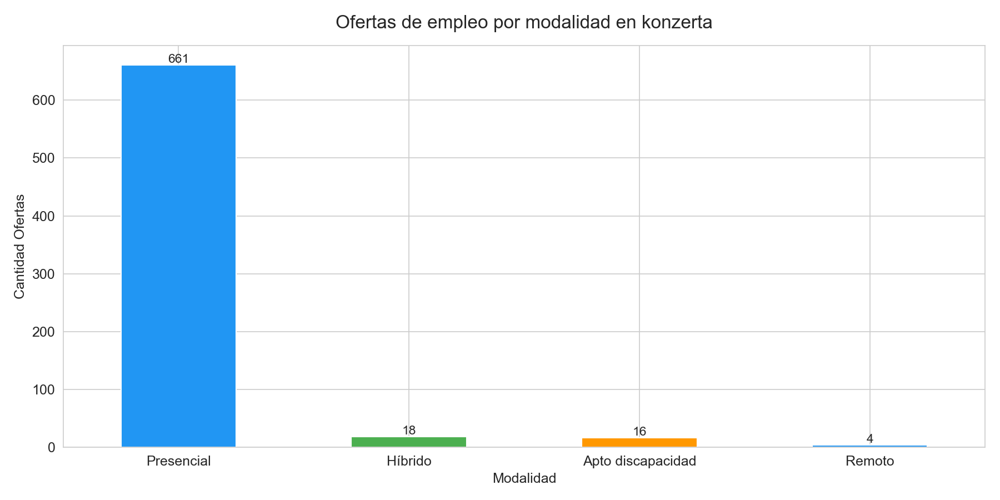
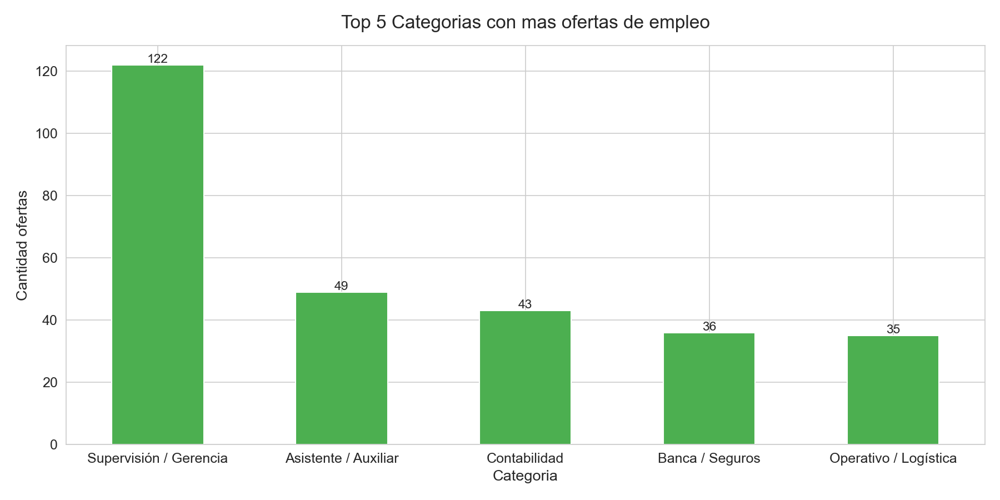
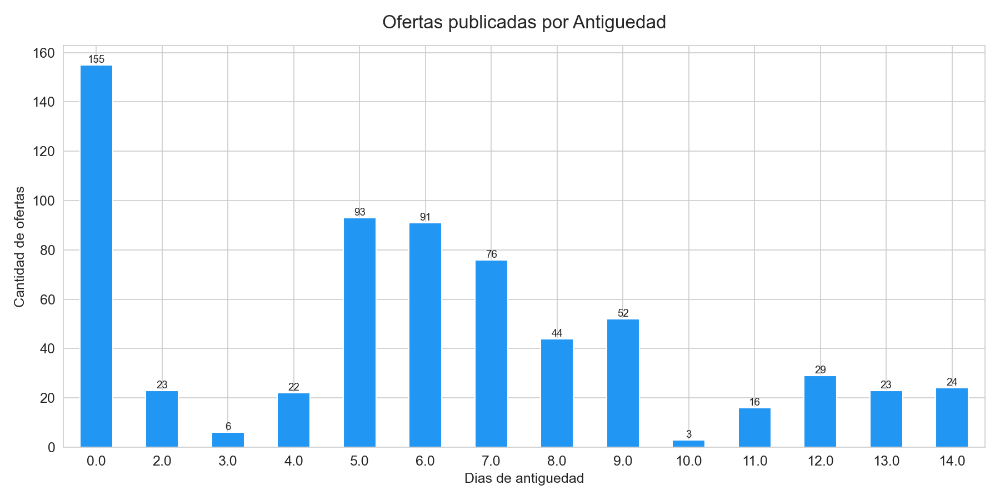

# analisis-mercado-laboral-panama

##Descripción
Análisis exploratorio de las ofertas de empleo publicadas en Konzerta Panamá durante los últimos 15 días de la fecha: 17-02-2026 . Los datos fueron obtenidos mediante web scraping con Python y Selenium.

## Objetivo
Identificar tendencias del mercado laboral panameño, incluyendo las categorías con más demanda, modalidades de trabajo y distribución geográfica de las ofertas.

## Tecnologías Utilizadas
- Python
- Selenium & BeautifulSoup (web scraping)
- Pandas (limpieza y análisis de datos)
- Matplotlib & Seaborn (visualizaciones)

## Hallazgos Principales

### 1. Modalidad de Trabajo
El 94% de las ofertas en Panamá son presenciales, confirmando que el mercado laboral panameño sigue siendo mayormente tradicional. Solo el 0.6% de las ofertas son remotas.

### 2. Top 5 Categorías con Más Demanda
Las áreas con mayor demanda de empleo en Panamá son Supervisión y Gerencia, Asistentes y Auxiliares, Contabilidad, Banca y Seguros, y Operativo y Logística.

### 3. Distribución por Categoría
El mercado laboral está concentrado en roles operativos y administrativos. El área de tecnología y datos todavía representa una porción pequeña del mercado laboral panameño.

## Visualizaciones

